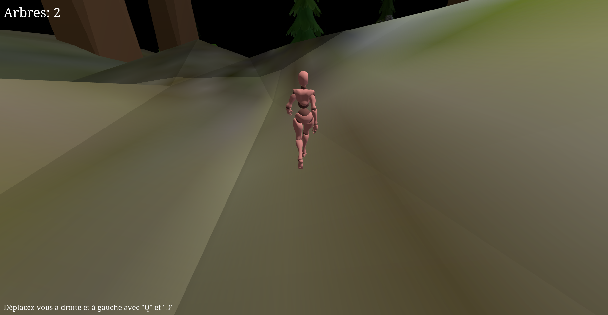
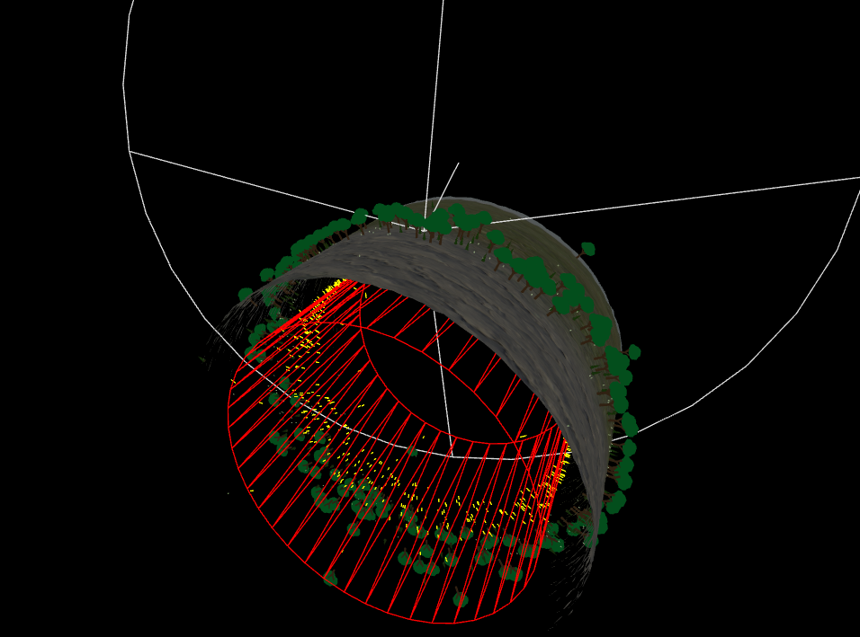

# Infinite Forest Terrain

Infinite Forest Terrain is an interactive Three.js project that creates the illusion of an endless forest. The environment is populated with various tree models that the player can interact with. Instead of moving the player through space, a rotating cylindrical terrain gives the impression of infinite exploration.

## Overview

- **Infinite Terrain Illusion:**  
  The terrain is modeled using a cylinder whose surface is dynamically modified. Although the player remains stationary, the cylinder rotates to simulate movement through an endless forest.



- **Interactive Trees:**  
  Various tree models (e.g., "just_tree", low-poly trees, stylized trees, and golems) are placed on the terrain. Each model interacts differently on collision:
  - **just_tree:** Colliding with these trees increments the counter.
  - **tree_golem:** Colliding with these models decrements the counter.
  - Other models (low-poly and stylized trees) are not interactive and are ignored during collision detection.

- **Topographic Terrain Generation:**  
  The terrain's vertices are modified (angles adjusted and merged) to create a natural, seamless landscape without holes.

## Features

- **Rotating Cylinder Terrain:**  
  Simulates an infinite forest by continuously rotating a cylinder around the player.

  

  
- **Dynamic Interactions:**  
  Collision detection triggers sound effects and updates a tree counter UI.
  
- **Audio Effects:**  
  Different sound effects are played depending on whether the player interacts with a "just_tree" or a "tree_golem".
  
- **User Instructions:**  
  On-screen prompts guide the player on how to navigate the scene (e.g., moving left and right with "Q" and "D").

## Technologies Used

- **Three.js:**  
  A powerful library for 3D graphics in the browser.
  
- **GLTFLoader:**  
  For loading 3D models in glTF format.
  
- **ES6 Modules:**  
  Code is organized into separate modules (e.g., `main.js`, `player.js`, `terrain.js`, `model.js`, `collector.js`).

- **HTML/CSS:**  
  For basic UI elements such as the tree counter and control instructions.

## Installation

1. **Clone the repository:**
   ```bash
   git clone https://github.com/yourusername/infinite-forest-terrain.git
   cd infinite-forest-terrain


# three_vite (How to test the project)
Basic THREE.js template using [Vite](https://vitejs.dev).

Allows testing and modifying [official THREE.js examples](https://threejs.org/examples/) locally, at lightning speed.
After trying Parcel and Rollup, this is probably the most developer-friendly to start THREE.js development in 2024 : it's insanely fast, it supports live reload out of the box, while remaining simple to use and to extend.

## Batteries included

Pre-configured to support :

- glTF file loading
- ammo.js wasm physics library
- VSCode launch scripts
- THREE.js type definitions : for IntelliSense in VS Code
- recommended VS Code extensions
- deployment

Have a look at vite.config.js and customize it to your needs (additional libraries, file formats etc.).

## Installation

Install [Node.js](https://nodejs.org)

- Clone or download repo
- run `npm install` : fetches and install all dependencies
- `npm run dev` : launches a server and opens your browser in `https://localhost:5173` by default
  - Edit your code : your changes are reflected instantly!
- `npm run build` : packages all code and resources into the `dist` folder, ready for deployment.


## HTTPS

HTTPS is required to use the WebXR API


### Using Cloudflare Tunnel for free without an account or a domain (recommended)

  - Install [Homebrew](https://brew.sh)

```bash
  /bin/bash -c "$(curl -fsSL https://raw.githubusercontent.com/Homebrew/install/HEAD/install.sh)"
```

then follow instructions


```bash
echo >> /Users/XXX/.zprofile

echo 'eval "$(/opt/homebrew/bin/brew shellenv)"' >> /Users/XXX/.zprofile

eval "$(/opt/homebrew/bin/brew shellenv)"
```

  - **[Install `cloudflared`](https://developers.cloudflare.com/cloudflare-one/connections/connect-networks/downloads/)**

```bash
brew install cloudflared
```
- run your app locally

```bash
npm run dev
```

- run `cloudflared` tunnel

```bash
cloudflared --url http://localhost:5173/
```

This will create a random temporary address ending in `*.trycloudflare.com`

You can share this address by sending a link or by generating a QR code (very useful for mobile devices and some XR headsets).

### Persistent link

If you want more persistence, you should register a domain name, or connect your github account to [Cloudflare Pages](https://pages.cloudflare.com) for free.

Alternatively, you could simply [use GitHub Pages to host your application persistently](https://sbcode.net/threejs/github-pages/).

### Tunneling alternatives

Check these tunneling alternatives such as `ngrok` or `zrok` for simple personal projects, use [tunneling solutions](https://github.com/anderspitman/awesome-tunneling) 


### Manual HTTPS setup

In order to use `https`, copy your certificates to the `.cert` folder, and change the `serve` command to:

`"serve": "http-server dist -S -C .cert/cert.pem -K .cert/key.pem`

## Deploying the App with GitHub Pages

(original: https://github.com/meta-quest/webxr-first-steps?tab=readme-ov-file#build-and-deploy)

This repository includes a ready-to-use GitHub Actions workflow located at `.github/workflows/deploy.yml`, which automates both the build and deployment to GitHub Pages. Once enabled, every time you push changes to the `main` branch, a new build will automatically be deployed.

#### Steps to Enable GitHub Pages Deployment:

0. **IMPORTANT: Set the `base` variable** in `vite.config.js` (default name `/three_vite`) to the actual name of your repository. Your app will be deployed to https://[GITUSERNAME].github.io/[REPOSITORY_NAME] (for example https://fdoganis.github.io/three_vite)
1. **Fork this repository** to your own GitHub account.
2. Navigate to your forked repository’s **Settings**.
3. Scroll down to the **Pages** section.
4. Under **Build and Deployment**, change the **Source** to **GitHub Actions**.

Once this is set, GitHub Actions will handle the build and deployment process automatically. Any time you push changes to the `main` branch, the app will be built and deployed to GitHub Pages without any additional manual steps.

You can monitor the status of the deployment job or manually re-run it via the **Actions** tab in your GitHub repository.

### Deploying to Your Own Hosting Solution

If you prefer to host the app yourself, you’ll need to manually build the app and then deploy the generated files to your hosting provider.

To generate the build, run the following command:

```bash
npm run build
```

This will create a `dist` folder containing the static files for the app. You can then upload these files to your hosting platform of choice.


# Credits

- Test model (red cube) from https://github.com/cx20/gltf-test/tree/master/sampleModels/Box (CC BY License)

- Some very interesting features (such as github pages deployment) have been borrowed from https://github.com/meta-quest/webxr-first-steps (MIT License)

  - Make sure to check this excellent tutorial out!
  - See [Deployment Instructions](https://github.com/meta-quest/webxr-first-steps?tab=readme-ov-file#build-and-deploy)
